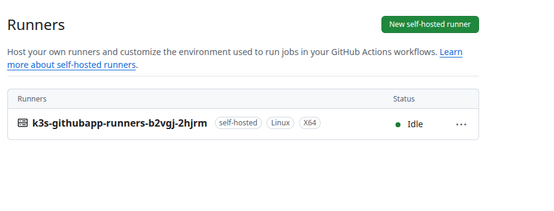
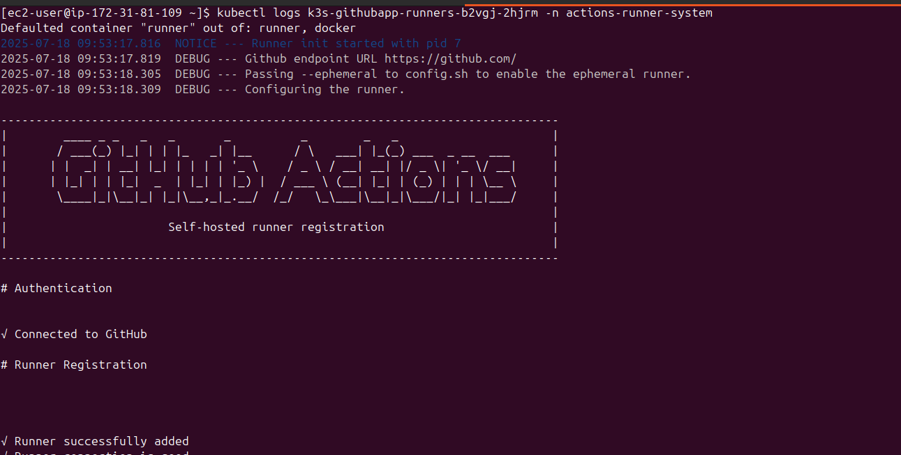

# k3s-arc

Setting up the **Actions Runner Controller (ARC)** on a server using **k3s** (a lightweight Kubernetes distribution) involves several steps. This will allow you to run **GitHub self-hosted runners on Kubernetes**, and the runners will automatically register and appear in your GitHub repository or organization.

## ✅ Prerequisites

Before you start:

1. ✅ A Linux server with **k3s** installed.
2. ✅ `kubectl` access to the k3s cluster.
3. ✅ Set env variable export `KUBECONFIG=/etc/rancher/k3s/k3s.yaml`.
4. ✅ A GitHub **App** created and configured.
5. ✅ Private key file (`.pem`) for the app.
6. ✅ A GitHub repo or org where you want to register the runners.


## ✅ Why GitHub App?

* 🔐 More secure than PAT (supports finer-grained permissions).
* 🔄 Automatic token rotation.
* 🧩 Required for some GitHub Enterprise or advanced use cases.

---

## 🧭 Step-by-Step: ARC with GitHub App (on k3s)

### 🛠️ 1. Create a GitHub App

Go to: [https://github.com/settings/apps/new](https://github.com/settings/apps/new)

#### Fill in:

* **GitHub App name**: e.g. `arc-runner-app`
* **Homepage URL**: any (e.g. `github-username/repo`)
* **Webhook URL**: leave empty (for now)
* **Permissions**:

  * **Repository**:

    * `Actions` → Read & write
    * `Administration` → Read & write
    * `Access to checks, code, metadata, and pull requests` → Read-only
    * `Metadata` → Read-only
  * (Optional: for org runners, use `Organization` > `Self-hosted runners`)
* **Subscribe to events**:

  * `check_run`
  * `check_suite`
  * `workflow_job`

#### After saving:

* Note the **App ID**
* Generate and download the **private key** (`.pem`)
* Install the app to your repo or organization

---

### 🔑 2. Create Kubernetes Secret with GitHub App Credentials

Create a namespace (if not already):

```bash
kubectl create namespace actions-runner-system
```

Then, create a secret with:

```bash
kubectl create secret generic controller-manager \
  -n actions-runner-system \
  --from-literal=github_app_id=<APP_ID> \
  --from-literal=github_app_installation_id=<INSTALLATION_ID> \
  --from-file=github_app_private_key=path/to/private-key.pem
```

Then, patch it

```bash
kubectl label secret controller-manager \
  -n actions-runner-system \
  app.kubernetes.io/managed-by=Helm --overwrite

kubectl annotate secret controller-manager \
  -n action-runner-ns \
  meta.helm.sh/release-name=arc \
  meta.helm.sh/release-namespace=actions-runner-system --overwrite
```

To get the **installation ID**, visit:

`https://api.github.com/users/YOUR_USERNAME/installations`
or
`https://api.github.com/orgs/YOUR_ORG/installations`

Use `curl` with a token or GitHub CLI:

```bash
gh api /user/installations
```
---

### 🔧 3. Install Cert-Manager

ARC depends on cert-manager for webhooks.

```bash
kubectl apply -f https://github.com/cert-manager/cert-manager/releases/latest/download/cert-manager.yaml
```

Wait a bit:

```bash
kubectl get pods --namespace cert-manager
```

Make sure all pods are running.

---

### 📦 4. Install ARC via Helm (App-based Auth)

```bash
helm repo add actions-runner-controller https://actions-runner-controller.github.io/actions-runner-controller
helm repo update
```

Then install ARC:

### 📎 Bonus: YAML + Helm Tips

You can also use a values.yaml like:

```yaml
githubApp:
  enabled: true
  appId: 123456
  installationId: 987654
  privateKeyFile: /etc/actions-runner-controller/github_app_private_key
```

Then install with:

```bash
helm upgrade --install arc actions-runner-controller/actions-runner-controller \
  -n actions-runner-system \
  -f values.yaml
```

> ARC will read the private key from the secret we created earlier.

---

### 🏃 5. Deploy a RunnerDeployment or RunnerSet

For example, a repository runner:

```yaml
apiVersion: actions.summerwind.dev/v1alpha1
kind: RunnerDeployment
metadata:
  name: my-githubapp-runner
  namespace: actions-runner-system
spec:
  replicas: 1
  template:
    spec:
      repository: your-user/your-repo
      labels:
        - self-hosted
        - linux
        - x64
```

Apply it:

```bash
kubectl apply -f runner-deployment.yaml
```

---

### ✅ 6. Verify on GitHub

Go to your repo → **Settings → Actions → Runners**
You should see your runner registered and online.


---

### 🧪 Optional: Check Runner Pod

You can verify the runner is running:

```bash
kubectl get pods -n actions-runner-system
kubectl logs <runner-pod-name> -n actions-runner-system
```

---

## 🧼 Cleanup (Optional)

To delete the runner:

```bash
kubectl delete -f runner-deployment.yaml
```

To uninstall the controller:

```bash
helm uninstall arc -n actions-runner-system
```

---

## ❓Need Org-Wide Runners?

Just change the runner spec:

```yaml
spec:
  template:
    spec:
      organization: your-org-name
```

And make sure the GitHub PAT has `admin:org` permissions.

---
